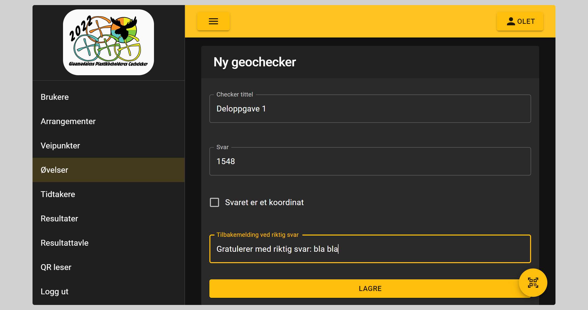

# Geochecker

## Brukes til

Geocheckere brukes ved teorioppgaver, hvor man vil ha flere sjekker av oppgave svar enn hva stopp koden kan tilby.

Man kan også angi at svaret skal være et koordinat og da vil det kunne verifiseres om koordinatet er innenfor x antall meter. Marginen er stardard 4 meter

Det er viktig å angi en tydelig tekst for når laget har svar riktig, så de vet hva som skjer videre
