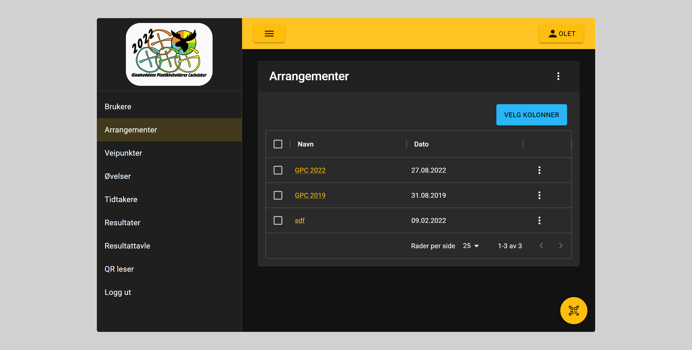
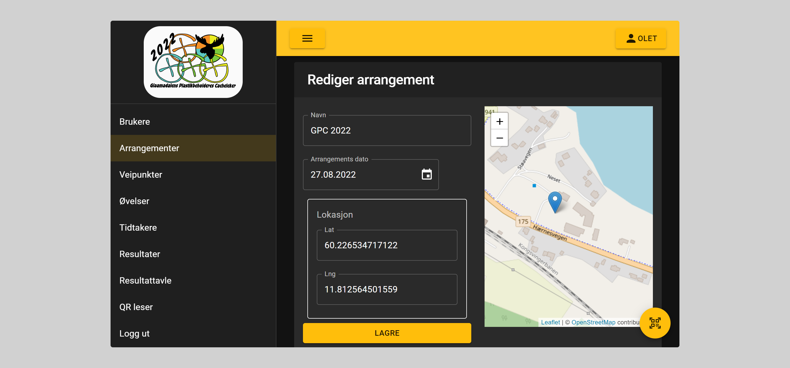

# Arrangement

## Brukes til

Arrangementet registrers for å kunne referere øvelsene til et arrangement. På denne måten kan vi, før start, ha synlige noen test øvelser.
Test øvelsene kan benyttes slik at deltakere kan øve seg på å starte og stoppe tidtakere.

## Registrering av arrangement

For arrangementet registreres navn, dato og lokasjon. Lokasjonen benyttes for å vise riktig sted på kartet da øvelsene skal registreres

## Begrensninger

Det er kun administrator som kan registrere og endre arrangementer
