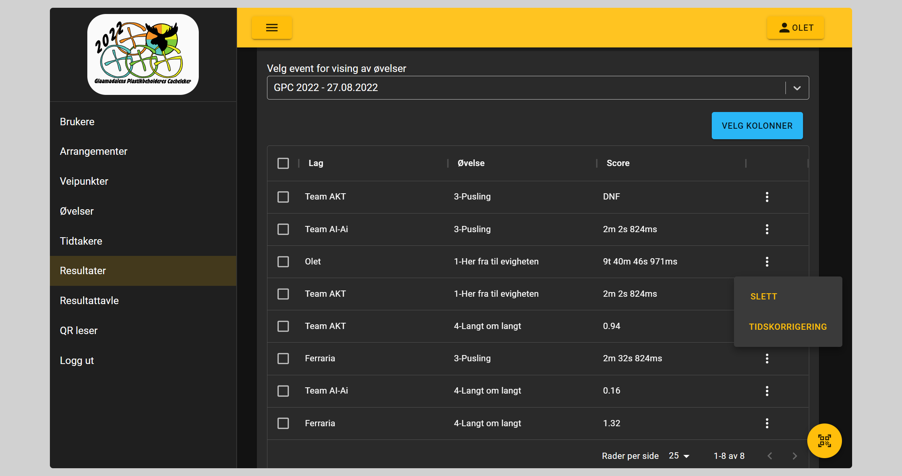
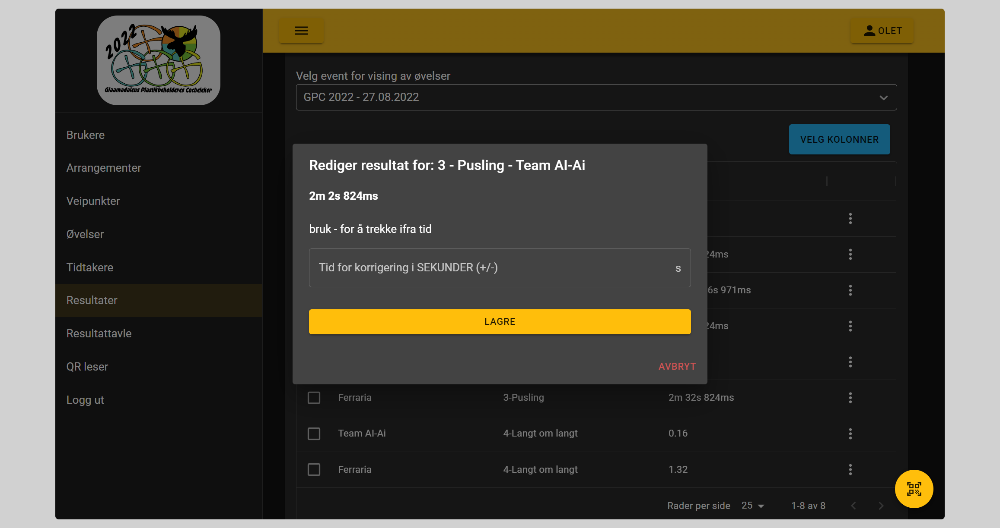

# Resultater

Her vil de som har ``Rediger resultat rolle`` eller ``Legg til resultat rolle`` kunne se en oversikt over alle resultater

## Endre resultat

For øvelser på tid vil endring av tid gjøres ved å angi endring av tid i sekunder. Minus for å trekke fra tid

For poeng eller lengde angis nytt resultat direkte

Det er også mulig å slette resultatet. Dette vil gjøre at laget kan starte på nytt med den øvelsen.

## Manuelt resultat

For å manuelt lagre resultat må følgende velges

- Arrangement, aktivt arrangement er allerede valgt
- Lag
- Øvelse
- Resultatet

### Tid øvelser

For tid registreres timer, minutter, sekunder og millisekunder i hvert sitt felt.
F.eks: ``5 minutter 59 sekunder  258 millisekunder``
For resultater som over, er det ikke nødvendig å fylle noe ut i feltet foran ``timer``

### Idealtid øvelser

For øvelser som utføres på idealtid skal brukt tid fylles ut. Differansen regnes automatisk ut

### Lengde og poeng øvelser

Her fylles resultatet direkte ut.

- Poeng øvelser støtter kun hele tall.
- Lengde øvelser støtter kun 2 desimaler
