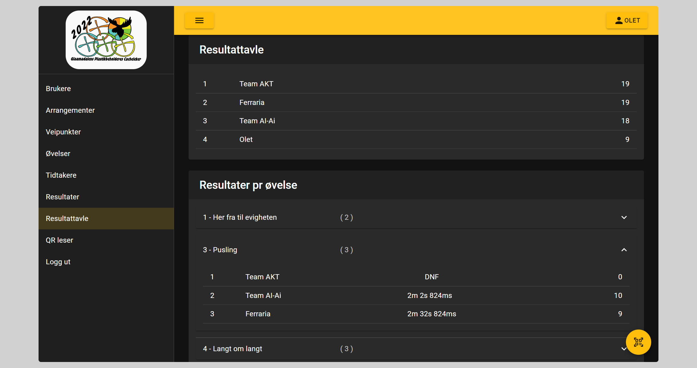

# Resultattavle

Her vil vi kunne fortløpende lese totalt resultat og pr øvelse. Dette er den samme oversikten som lagene kan se på sin bruker. Forskjellen er at lagene kan ikke se andres score på øvelsene

## Beregning av poeng

- Beste lag på øvelsen blir tildelt 10 poeng
- Videre tildeles poeng nedover 1 poeng mindre for hver plass
- Minste poengsum som tildeles er 1 poeng
- For lag som "gir opp" en øvelse vil de bli registert med DNF og 0 poeng
- Når lag har lik score vil de tildeles samme poengsum
