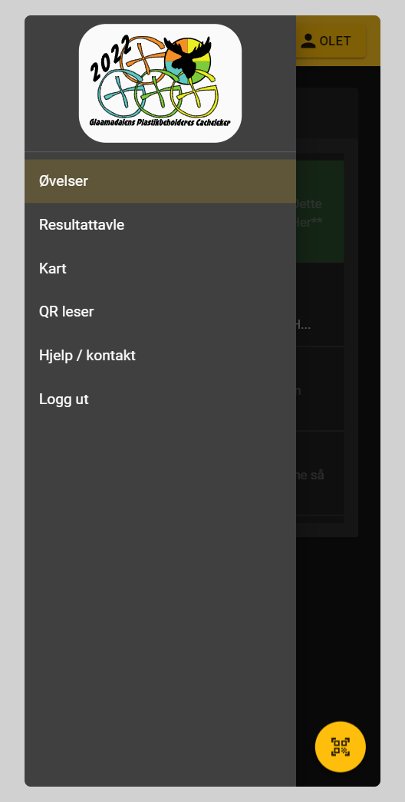
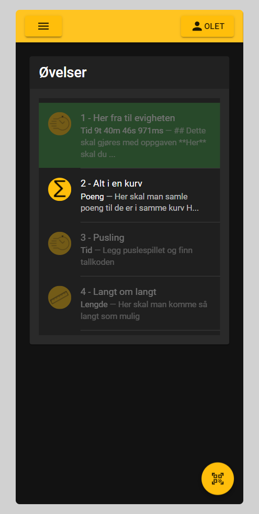
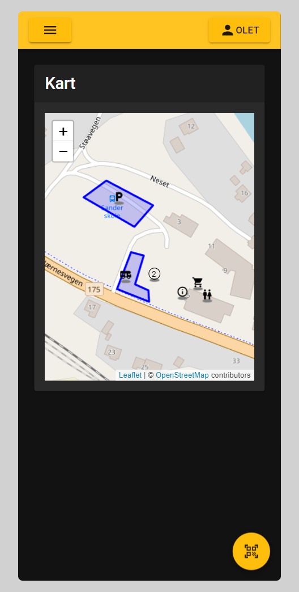
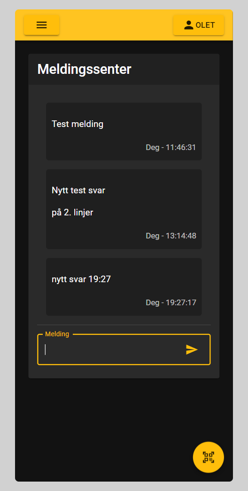

# For lag

Lag har tilgang til

- Oversikt over øvelsene
- Resultattavle
- Kart
- QR leser
- Hjelp/kontakt

## Oversikt over øvelsene

For stengte øvelser vil de være "deaktivert" i lista. Øvelsene vil ha forskjellige farge etter status

- Grønn - Fullført (Resultatet vil også vises)
- Blå - Øvelsen pågår
- Rød - Øvelsen ble gitt opp og er markert som DNF

## Kart

Kartet viser aktive øvelser, og andre veipunkter

## Meldingssenter

Det er satt opp et meldingssenter der lagene kan sende melding til oss arrangører. Dette er hvis de har spørsmål eller problemer med øvelser. Meningen er at de skal slippe å lete etter noen som kan svare.

Vi som arrangører vil motta disse meldingene i slack, og vil også svare der.
