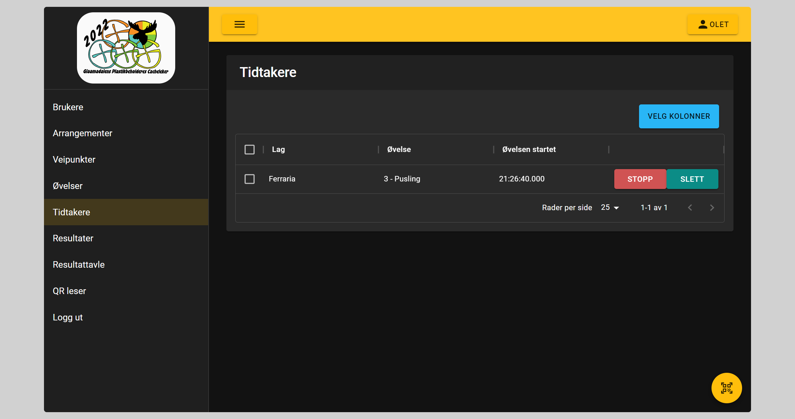

# Tidtakere

Her vil de som har ``Rediger resultat rolle`` kunne se en oversikt over alle aktive tidtakere. Vi kan også stoppe eller slette tidtakeren

## Stoppe tidtaker

Ved stopp av tidtaker vil laget få et resultat registrert for den øvelsen. Resultatet vil være tiden fra start til det ble trykket på stopp knappen.
Laget vil **ikke** kunne starte oppgaven på nytt

## Slette tidtaker

Ved sletting av tidtaker vil laget ikke få registert noe resultat og de kan starte oppgaven på nytt
