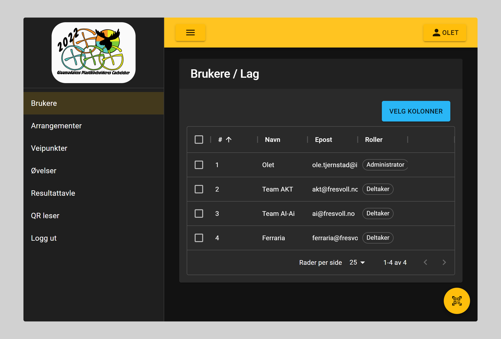

# Brukere / Lag

## Bruker roller

- Administrator
  - Tilgang til alle funksjoner
- Rediger brukere
  - Legge til nye og endre eksisterende brukere
- Endre resultater
  - Slette registrerte resultater
  - Redigere poeng og lengde resultater
  - Legge til eller trekke fra tid
  - Stoppe tidtakere
- Legge til resultat
  - Manuelt registrer resultater på øvelser
- Arrangør
  - Har tilgang til å endre øvelser, veipunkter og geocheckere
  - Og se oversikt registrerte opplysninger
- Deltaker
  - Delta i øvelser

## Lag

Lag opprettes av arrangør som har fått tildelt rollen for oppretting av brukere. Når brukeren er lagret vil de motta en epost med en link. Denne linken må de benytte for å kunne velge passord på brukerkontoen sin. Denne linken er gyldig kun en gang og kun i 2 timer etter oppretting

## Andre brukere

Andre brukere blir registrert på samme måte som lag, men tildeles ett eller flere av rollene som nevnt over.
