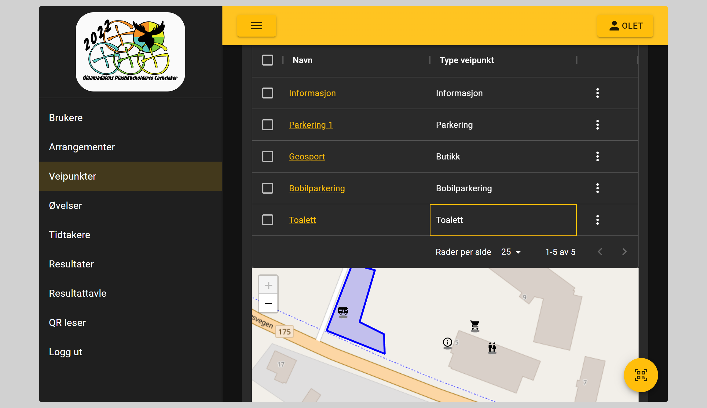
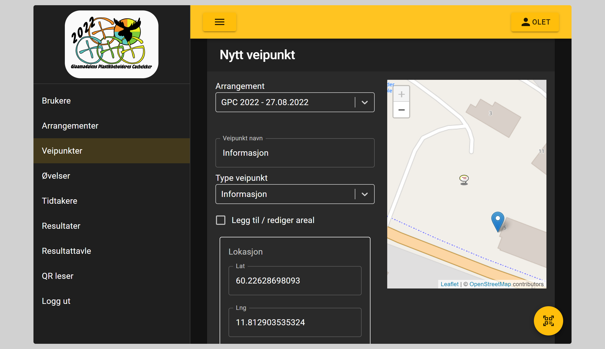

# Veipunkter

## Brukes til

Veipunkter brukes for å vise på kart til brukerne hvor de kan finne andre ting enn øvelser

## Type veipunkter

- Informasjon
- Butikk
- Toalett
- Parkering
- Bobilparkering

## Registrering

For veipunkter registeres

- Hvilket arrangement de tilhører
- Navn på veipunktet
- Lokasjon
- Det kan også tegnes opp areal på kartet

Ved registrering vises lokasjonen for valgte arrangement, dette for å lettere registere veipunktet på riktig sted
